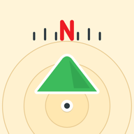
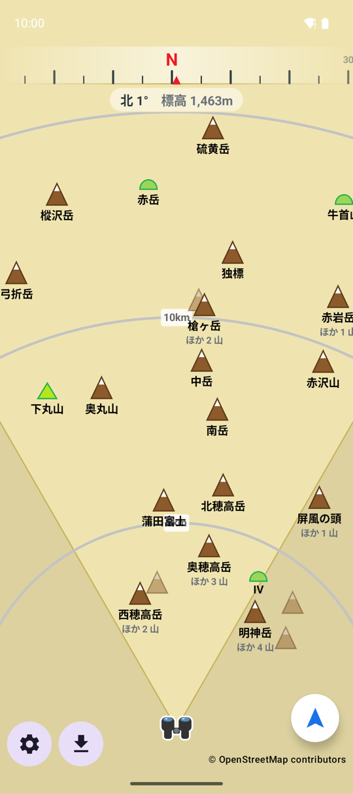
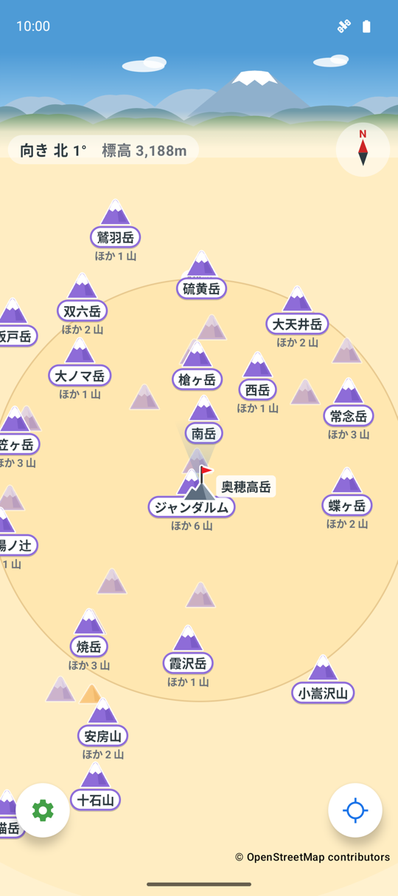

#  山むき

スマホを向けた方向に見える山を、山名付きで表示する Android / iOS アプリ。山をタップすると標高などの詳細が見られる。

- Android 版: Kotlin + Jetpack Compose
- iOS 版: Swift + SwiftUI（Android 版とほぼ同じ機能）
- 山データは OpenStreetMap のデータから作った全国の山頂データを [yamamuki-data](https://github.com/shohei0205/yamamuki-data) から取得し、端末内に保存してオフラインでも使えるようにする

| ヘディングアップモード | 手動位置モード |
|---|---|
|  |  |

## 構成

- `android/` Android 版の Gradle プロジェクト。Android Studio ではこのフォルダを開く。
- `android/core/` Android に依存しないデータ取得ロジック（配布データの取得・検証・取り込み、距離と方位の計算、キャッシュ方針。使っていない Overpass API の問い合わせ・解析も残している）。単体でテストできる。
- `android/app/` Android アプリ。Room によるキャッシュ実装、設定、画面。
- `ios/YamamukiCore/` iOS に依存しないロジックの Swift パッケージ。`android/core/` を Swift に移植したもので、単体でテストできる。キャッシュはタイルごとの JSON ファイル（`FileMountainCache`）に保存する。
- `ios/Yamamuki/` iOS アプリ。方位盤の描画（`DialCanvasView`）、画面（`DialView`）、設定（`SettingsView`）、現在地と方位の取得（`LocationService`）。画面の文言は `Localizable.xcstrings` にまとめ、Android の `android/app/src/main/res/values/strings.xml` と同じキー名にしている。
- `ios/YamamukiUITests/` iOS アプリの UI テスト（XCUITest）。アプリを起動して方位盤と設定の画面を開き、画面を撮る。
- `ios/project.yml` Xcode プロジェクトの設定（[XcodeGen](https://github.com/yonaskolb/XcodeGen) 用）。`ios/Yamamuki.xcodeproj` はここから生成し、git には入れない。
- `site/` GitHub Pages で公開するページ（プライバシーポリシー `site/privacy/index.html` → https://shohei0205.github.io/yamamuki/privacy/ ）と、山データの参照先ファイル（`site/data/osm-peaks/`）。main に入ると `.github/workflows/pages.yml` で公開する（Settings → Pages の Source は「GitHub Actions」）。

## 開発環境

### Android 版

| 必要なもの | バージョン |
|---|---|
| JDK | 17 以上（21 で動作確認） |
| Android SDK Platform | 36（`compileSdk` / `targetSdk`） |
| Android SDK Build-Tools | 36.0.0（`buildToolsVersion` で固定） |
| Gradle | 8.14.3（`gradlew` が自動でダウンロードする） |
| 実行する端末 | Android 8.0 (API 26) 以上。現在地の標高表示は Android 14 以上 |

- Android SDK の場所は、環境変数 `ANDROID_HOME` か、`android/local.properties`（git 管理外）で指定する。
  ```properties
  sdk.dir=C\:\\Users\\<ユーザー名>\\AppData\\Local\\Android\\Sdk
  ```
- SDK のライセンスに未同意だとビルドが止まる。`sdkmanager --licenses` で同意しておく。
- Visual Studio に付属する SDK（`C:\Program Files (x86)\Android\android-sdk`）は書き込みできないため、ビルドのたびに「Probably the SDK is read-only」と出るが、ビルドには影響しない。足りないパッケージを Gradle が自動で入れられないので、必要なものは管理者権限の `sdkmanager` で入れる。

### iOS 版

| 必要なもの | バージョン |
|---|---|
| Mac + Xcode | Xcode 16 以上（16.4 で動作確認） |
| XcodeGen | `brew install xcodegen` で入れる |
| 実行する端末 | iOS 15 以上の iPhone（縦向き固定） |

- iOS アプリのビルドと iPhone への転送には Mac が必要。Mac が無くても、ビルドが通るかは GitHub Actions（`.github/workflows/ios.yml`）で確認できる。
- シミュレーターでも起動できるが、方位センサーが無いので方位盤は回らない。現在地はシミュレーターのメニュー（Features > Location）で指定する。

## ビルドと実行

### Android 版

Gradle のコマンドは `android/` で実行する。

```bash
cd android

# core の単体テスト
./gradlew -p core test

# デバッグ用 APK のビルド（android/app/build/outputs/apk/debug/app-debug.apk）
./gradlew :app:assembleDebug

# アプリの単体テスト（DB の移行など。Robolectric で動かす）
./gradlew :app:testDebugUnitTest

# USB でつないだ端末にインストール
./gradlew :app:installDebug
```

- 端末側で「開発者向けオプション」の「USB デバッグ」を有効にし、つないだときに出る「USB デバッグを許可しますか？」で許可する。
- つながっているかは `adb devices` で確認する（`device` と出れば OK、`unauthorized` なら端末で許可する）。PowerShell で adb をフルパスで実行するときは、先頭に `&` を付ける。
  ```powershell
  & "C:\Program Files (x86)\Android\android-sdk\platform-tools\adb.exe" devices
  ```
- 山データの取得に失敗したときは、原因を logcat にタグ `DialViewModel` で出している。
- 開発版はアプリ ID が `io.github.shohei0205.yamamuki.debug`、名前が「山むき(開発版)」になり、配布版と同じ端末に並べて入れられる。

### iOS 版

```bash
cd ios

# core の単体テスト
(cd YamamukiCore && swift test)

# Xcode プロジェクトを生成して開く（project.yml を変えたら生成し直す）
xcodegen generate
open Yamamuki.xcodeproj
```

- Xcode で `Yamamuki` ターゲットの「Signing & Capabilities」の Team に自分の Apple ID を選ぶ。無料の Apple ID でも、自分の iPhone に 7 日間有効な開発用署名で入れられる（期限が切れたら Xcode から入れ直す）。
- iPhone を USB でつなぎ、Xcode 上部の実行先に選んで Run（⌘R）する。初回は iPhone の「設定 > プライバシーとセキュリティ > デベロッパモード」をオンにし、「設定 > 一般 > VPN とデバイス管理」で開発元を信頼する。
- コマンドラインでビルドだけ確認するときは、CI と同じ次のコマンドを使う。UI テストのコードも一緒にビルドする。
  ```bash
  xcodebuild build-for-testing -project Yamamuki.xcodeproj -scheme Yamamuki \
    -destination 'generic/platform=iOS Simulator' CODE_SIGNING_ALLOWED=NO
  ```
- UI テストは Xcode で ⌘U、またはコマンドラインで次のように動かす。実機でもシミュレータでも動く。
  ```bash
  # シミュレータ
  xcodebuild test -project Yamamuki.xcodeproj -scheme Yamamuki \
    -destination 'platform=iOS Simulator,name=<シミュレータ名>' CODE_SIGNING_ALLOWED=NO
  # 実機（UDID は xcrun devicectl list devices で調べる。Team ID は Xcode の Settings > Accounts で見る）
  xcodebuild test -project Yamamuki.xcodeproj -scheme Yamamuki \
    -destination 'id=<UDID>' -allowProvisioningUpdates DEVELOPMENT_TEAM=<Team ID>
  ```
  - 初回起動の「山データを取得」には「あとで」で答え(テストのたびに通信しないため)、位置情報の許可には「使用中は許可」で答える。実機では端末に入っている山むきの設定をそのまま使う。
  - テストで撮った画面はテスト結果に残り、Xcode の Report ナビゲータで見られる。
  - テストが終わると、テストした端末で山むきを起動し直す（スキームのテスト後の処理）。
- 山データの取得に失敗したときは、原因を Xcode のコンソール（または Mac の「コンソール」アプリ）にカテゴリ `DialModel` で出している。

## Android 版と iOS 版の違い

画面の構成、設定項目、キャッシュの仕組み、通信量は同じ。端末の機能に合わせて次の点が違う。

| 項目 | Android 版 | iOS 版 |
|---|---|---|
| 方位 | 回転ベクトルセンサーから計算し、偏角を足して真北に直す | Core Location の heading。iOS が偏角を補正した真方位を返す |
| 方位の精度の判定 | 地磁気センサー（無い端末は回転ベクトル）が知らせる精度の段階（「低い」「当てにならない」で低いとする） | heading の誤差の見積もり（30° を超えるか無効なら低いとする） |
| 現在地の標高 | GPS の楕円体高を Android 14 以降のジオイドモデルで海抜に直す | Core Location の altitude（海抜）をそのまま使う |
| キャッシュ | Room（SQLite） | タイルごとの JSON ファイル（アプリの Application Support 内） |
| キャッシュの自動バックアップ | 含めない（古い版の DB が戻って起動できなくなるのを防ぐ） | iOS の既定のまま（版を持つ DB ではないので戻っても読める） |
| 位置と方位の精度 | 位置の更新を頼む間隔（省電力 30 秒・標準 10 秒・高精度 5 秒）と方位センサーの値を受け取る間隔（100・60・20 ミリ秒）を変える | 位置の精度（100m・10m・最高）と、方位が届く変化の大きさ（2°・1°・1°）を変える |
| 設定の保存 | SharedPreferences | UserDefaults |
| 山の詳細 | ダイアログ | 下から出るシート |
| 位置情報を断ったとき | 許可を求め直す | 設定アプリを開くボタンを出す（iOS はアプリから再度聞けない） |

## 方位盤の画面

- 端末を向けている方位を上にした平面図に、山をアイコンと山名で描く。現在地は画面下部の双眼鏡のアイコンで、山頂にいるときは代わりに旗の立った山頂アイコンと山名を出す。山のアイコンは白い縁と影の付いた丸みのある山の形で、標高で色と高さを変える。1000m 未満(標高不明を含む)は緑の低い山、2000m 未満は橙の山、2000m 以上は頂に雪を載せた紫の高い山。色の区別がつきにくくても、高さと雪の有無で見分けられる。山名は白い札に載せ、札の縁をアイコンと同じ色にする。
- 地面はクリーム色で、距離は等倍。同心円が距離の目安で、円の間を現在地に近いほど濃い淡い色の帯で塗り分ける(近い 3 本まで)。距離の数字(10km など)は白い札に載せる。双眼鏡は白い丸の上に置く。
- 画面の最上部は高さ 64dp のヘッダーで、青空と遠くの山並みを描く(画像は使わず、両 OS とも図形で描く)。将来、小さなバナー広告(320×50dp)を置くための場所で、広告の有無にかかわらず高さは変えない。山並みは方位目盛りの裏まで続き、手前の裾野を方位盤の地面のクリーム色に溶かす。ステータスバーの裏も空の色で塗る。
- ヘッダーの下は方位の目盛り(幅 60°。東西南北のほかに 30° ごとの数字を添える)と、その下の淡い白の札に「北東 45°　標高 312m」のような表示。センサーは磁北基準なので、現在地の偏角を足して真北に直している。標高は GPS の高さ(楕円体高)を Android 14 以降のジオイドモデルで海抜に直したもので、求められないときは出さない。
- 現在地は、届いた位置のうち直前より精度(誤差の半径)がはっきり悪いもの(山で GPS の合間に届く、基地局や Wi-Fi から推定した位置など)を使わない。許す誤差は時間とともに広げ(直前の誤差 + 50m + 経過秒 × 2m)、良い位置が長く届かないときだけ精度の悪い位置も使う。Android 版は立ち止まっていても GPS の位置が 5 秒ごとに届くようにしている。
- 方位センサーの精度が低いとき(Android は地磁気センサーが知らせる精度が「低い」以下、iOS は方位の誤差の見積もりが 30° を超えるか無効のとき)は、上部の情報ラベルの下の中央に、方位の札と同じ淡い白の札で「方位が不安定です。8の字に動かしてください」と出す。起動したときから精度が低い場合も出す。
- 端末を立てて構えたときは背面の向き、水平に持ったときは上端の向きを方位とする(途中の傾きでも連続)。
- ピンチで表示範囲(画面上端までの距離)を 2〜80km で変えられる。範囲に応じて保存済みの山データを 20 / 50 / 120km の半径で読み込む。
- 表示する山は、現在地から見上げる角度(仰角)の大きい順に選ぶ。近くの低い山は大きく見えるので優先され、遠くの山は地球の丸みで沈む分(大気の屈折を考えて)だけ低く見積もる。現在地の標高は GPS の海抜を使い、分からないときは 0m とみなす。
- 山は、画面より一回り大きい、画面の周りの円から集めておく。集め直すのは、山の一覧・表示範囲などが変わったときと、向きを変えたり地図を動かしたりして画面がこの円からはみ出したとき(ヘディングアップでは向きを 10〜15° ほど変えるごと)。
- 画面に入る山すべてをこの順に並べ、上から山名を出す。山名の数は設定の「山名の最大数」まで。前回描いた山は少し残りやすくする。
- ヘディングアップでは、正面に近い山ほど優先する。正面の山の仰角に 1° を上乗せし、正面から離れるほど減らして、視野の扇の端(左右 30°)で 0 にする。向けた先の山が、横の山に押し出されにくくなる。
- ヘディングアップでは、表示範囲を広げるほど高い山を優先する。表示範囲 20km から 60km にかけて、標高 1000m あたり 0° から 2° を仰角に上乗せする。遠くまで表示しているときは、近くの低い山より遠くの高い山の名前を知りたいことが多いため。手動位置モードでは、どちらの上乗せもしない。
- 視界の正面(ヘディングアップでは視野の扇、手動位置モードでは画面の中央の円(直径は画面の幅))の山は、山名を出さない山もアイコンだけで描く。山の多い方角から少ない方角へ向けたときに、山が急に現れたように見えないようにするため。範囲の縁(扇の端の 8°、円の縁の 2 割)では、外へ行くほど薄くする。
- 山名を出さない山のアイコンは、優先度が低いほど薄くする(仰角 0° 以下で 0.15、3° 以上で 0.6)。山名や「ほか 3 山」にかかるアイコンは、消さずに一番薄く描き、押しても反応しない。
- 山名は 0.25 秒かけて出し入れし、アイコンの濃さも時間をかけて変える。まとめた山でなくなった山や、範囲を出た山も、急に消さずにだんだん薄くする。濃さを変えている間だけ毎フレーム描き直す。
- 山アイコンは、標高の区分と影の有無ごとに一度だけ描いた画像を、濃さを変えて貼る。1 画面に数百のアイコンを描くことがあるため。
- 画面に描くときは、今の向きで山名とアイコンが重なる山の山名を省き、アイコンだけを薄く残す。山名を出す代表の山には、山名の下に「ほか 3 山」のように省いた山の数を添える(ほかの山名と重なるときは添えない)。省いた山のアイコンは代表の山のアイコンとは重なってよい。標高が分からない山のアイコンは描かない(一覧には出る)。
- 互いに 3km 以内の山どうし(奥穂高岳とジャンダルムなど、主峰と肩・前衛峰)が重なるときは、仰角によらず標高の高い山を代表にする。山の並ぶ順によらず、高い山から順に決める。
- 前回描いていた山を先に置くので、向きを変えたり、優先度の高い山が画面の端から入ってきたりしても、描いている山は実際に重なるまで消えない(点滅しない)。新しく山名を出す山は、ほかの山と少し余白があるときだけ出す。山名の数の上限(設定で変えられる)も、前回描いていた山を先に残す。
- 画面の上端では、描いている山(アイコンだけの山を含む)は山の位置が上端を越えるまで残し、新しく出す山はアイコン全体が入ってから出す。山は正面に向けたときに画面の最も上に来るので、上端の少し先の山が、向きをわずかに変えるたびに出たり消えたりしないようにするため。
- 山をタップすると、山名・標高・緯度経度・現在地からの距離を表示する。「ほか 3 山」を添えた代表の山か、薄く描いた省いた山のアイコンをタップすると、まとめた山の一覧(山名・標高・距離)を出し、選んだ山の詳細を開ける。
- 左下の歯車ボタンで設定画面を開く。右下のモード切替ボタンと同じ白い丸いボタン(影付き)で、同じ高さに置く。アイコンの色は、設定が緑、事前ダウンロードが橙、モード切替が青。

## 山データの取得

全国の山頂データ(約 14,000 件、約 0.45 MB)を [yamamuki-data](https://github.com/shohei0205/yamamuki-data) から取得し、端末に保存する。方位盤は保存したデータだけで表示し、自分では通信しない。

- 初回起動時に「山データを取得」を聞く。「取得する」を選ぶとすぐに取得し、「あとで」を選んだときは設定画面の「山データ」から取得できる。位置情報の許可はこのあとに聞く。
- 設定画面の「山データを更新」(取得済みなら「更新を確認」)で取り直せる。新しい版がなければ確認だけで終わる。
- 読む manifest は、yamamuki の Pages に置いた参照先ファイル `current.json`（https://shohei0205.github.io/yamamuki/data/osm-peaks/current.json ）で決める。URL は core の `PeakData` にある。
  - 配布用のビルド(Android の release、iOS の Release)は、`current.json` の `stable` が指す manifest を読む。
  - 開発用のビルド(Android の debug、iOS の Debug)は、既定では `current.json` の `dev` が指す manifest を読む(`dev` が無ければ `stable`)。配布版の `stable` を変えずに、新しい版のデータを試せる。
  - 開発用のビルドで取得先を `dev` にすると、yamamuki-data の dev が公開する最新の開発版 `https://shohei0205.github.io/yamamuki-data/points/osm-peaks-dev/manifest.json` を直接読む。画面からは切り替えられず、ビルドのときに選ぶ。
    - Android: Gradle のプロパティ `peakDataSource=dev` を付ける(例: `./gradlew :app:installDebug -PpeakDataSource=dev`。`~/.gradle/gradle.properties` に書いてもよい。既定は `current`)。`android/app/build.gradle.kts` で `BuildConfig.PEAK_DATA_DEV` になる。
    - iOS: ビルド設定 `PEAK_DATA_SOURCE` を `dev` にする(例: `xcodebuild ... PEAK_DATA_SOURCE=dev`。Xcode ではターゲットの Build Settings の User-Defined で変える。`xcodegen generate` で既定の `current` に戻る)。`ios/project.yml` で `PEAK_DATA_DEV` の条件が付く。
  - 読み先を切り替えたビルドは、前の読み先の版と違えば取り直し、保存している山データを入れ替える。
- `current.json` は毎回取り直す(数百バイト)。指す manifest の SHA-256 が前回と同じなら、manifest は取り直さない。違えば manifest を取り、SHA-256 が `current.json` と合うかを確かめる。`current.json` が yamamuki の `manifests/` 以外を指しているときは読まない。yamamuki-data の開発版を直接読むときは、manifest に前回の ETag を付けて問い合わせ、変わっていなければ何も受け取らない。
- 版が新しいときだけデータ本体(manifest の `downloadUrl`)を取得し、サイズと SHA-256 を確かめてからキャッシュに取り込む。失敗したときは保存済みのデータをそのまま使い、画面中央で知らせる(「もう一度取得」で取り直せる)。
- 参照先ファイルは `site/data/osm-peaks/` にある。
  - `current.json`: `stable`(必須)と `dev`(省略可能)に、読ませる manifest の URL と SHA-256 を書く。
  - `manifests/<タグ>.json`: yamamuki-data の Release の `manifest.json` を書き換えずにコピーしたもの。差し替えるたびに 1 つ増やし、一度置いたファイルは上書きも削除もしない（前の版に戻すとき、そのまま使えるようにするため）。データ本体は yamamuki-data の Release のものを使う。
- 参照先ファイルは手で書き換えず、Actions の「山データの差し替え PR を作る」を main で手動で動かして、差し替えの PR を作る（実行できるのは書き込み権限のある人だけ）。
  - 差し替える先（`dev`・`stable`・`dev` を外す `remove-dev`）と Release のタグ（空なら最新）を選ぶ。`stable` には正式版の Release（タグ `osm-peaks-…`、manifest の版 5）だけを置ける。
  - PR は GitHub App のトークンで作る（標準のトークンで作った PR では CI が動かないため）。App の ID と鍵は、main だけが使える環境 `data-swap` の変数 `APP_ID` とシークレット `APP_PRIVATE_KEY` に置いている。
  - PR の CI「山データの確認」が、コピーが Release と同じか、`manifests/` が追加だけか、データ本体の大きさと SHA-256、`stable` の件数が 5% より多く減っていないかを確かめる。件数が減るのを確かめたうえで通すときは、PR にラベル「山データの件数減を確認済み」を付ける。
  - core の単体テスト（`SitePeakDataTest`）が、`current.json` の指す manifest をアプリの読み込み処理で読めるかを確かめる。
  - マージ後は Pages の公開のあとに、公開中の内容が git と同じかを確かめる。公開中の `current.json` から manifest とデータ本体までたどれるかは、「山データの見張り」で毎日確かめ、失敗したら Issue で知らせる。
  - 確認の処理は `.github/scripts/peak_data.py` にある。
- 対応する manifest の形式は schemaVersion 4 と 5。版 5 では、データ本体の版(`dataSchemaVersion`)が 5 のときだけ取り込む。知らない版や、データ本体の版が書かれていないときは取り込まず、アプリの更新を促す。
- 版 5 のデータ本体(地点データ)は、山ごとの項目が版 4 までと同じなので、同じ読み方で読む。山頂以外の種別(`type`)の地点と、`osmId` の無い地点は飛ばす。
- 取り込みと取り込み済みの版の記録は `android/core/.../PeakData.kt` と `ios/YamamukiCore/.../PeakData.swift` にある。
- OpenStreetMap の Overpass API から取得していたころに分かったことは [docs/peak-data-notes.md](docs/peak-data-notes.md) にまとめた。

以前の都道府県単位の事前ダウンロード(Overpass から取得)は、`Features.AREA_DOWNLOAD`(Android、`android/app/.../Features.kt`)と `Features.areaDownload`(iOS、`ios/Yamamuki/Features.swift`)を false にして隠している。コードは残してある。

## 設定

| 項目 | 内容 | 既定 |
|---|---|---|
| 最低標高 | この標高以上の山だけ表示する（0〜3,000m）。絞り込み中は標高不明の山を出さない | 0m（すべて） |
| 山名の最大数 | 1 画面に出す山名の数（5〜30）。山名を出さない山はアイコンだけで描く。以前の「最大表示数」で 30 より大きい値にしていたときは 30 になる | 15 |
| 文字の大きさ | 小・標準・大・特大 | 標準 |
| 起動時の表示距離 | 5〜50km | 15km |
| 画面を常に点灯 | 方位盤の表示中は画面を消さない | オフ |
| 位置と方位の精度 | 省電力・標準・高精度の 3 段階。精度を下げるとバッテリー消費を抑えられるが、現在地や方位の更新頻度も下がる | 標準 |
| 山データ | 取得した山データの件数・元データの日付・取得日の確認と、取得・最新版の確認 | — |
| キャッシュ | 保存している山の件数・容量の確認と消去(消すと山データも消える) | — |

設定は端末内（Android は SharedPreferences、iOS は UserDefaults）に保存する。

方位盤は山データを取得せず、保存済みのデータだけで表示する。以前の Overpass からの自動取得、手動取得の更新ボタン、設定の「山データを手動で取得」「取得したデータを使う期間」はなくした。

## キャッシュの仕組み

緯度経度 0.5° 四方のタイル単位で「取得済みか・いつ取得したか」を記録する。方位盤はキャッシュ済みのデータだけで表示し、範囲に未取得のタイルがあれば画面上部で知らせる(山データをまだ取得していないときは、設定画面から取得できることも添える)。

山データを取り込むときは、日本の端の島まで入る範囲(北緯 20〜46°・東経 122〜154°)のタイルを置き換えて取得済みにする。山のない海のタイルも取得済みになり、新しい版で消えた山や、以前 Overpass で取った山は残らない。ただし、この範囲に入る日本の外の陸地(朝鮮半島・済州島・ロシアの沿海地方・サハリンの南端など)は取得済みにしない。方位盤は、現在地が日本側ならこれらのタイルを欠けたものとして数えず(国境の近くで「一部の山データがありません」と出続けないように)、現在地がこれらの陸地の中なら「データがありません」と知らせる。

Android 版では、山データのキャッシュと、事前ダウンロードした地域・取り込み済みの全国の山データの記録を、端末の自動バックアップに含めない(取り直せるため。アンインストール後に入れ直しても古いキャッシュは戻らない)。Android 12 以降の端末では、機種変更で端末間で移すときは引き継ぐ(Android 11 以前は移すときも引き継がない)。また、新しい版のアプリが作ったキャッシュを古い版のアプリで開いたときは、落ちずにキャッシュと事前ダウンロード・取り込み済みの全国の山データの記録を消して作り直す(全国の山データは設定画面から取り直せる)。

## 通信量の目安

- 山データの取得は 1 回で約 0.45 MB(gzip 圧縮のまま受け取る。2026 年 10 月の開発版で 451,151 バイト)。
- 最新版の確認は manifest(1 KB 未満)だけで、変わっていなければ HTTP 304 で本文も届かない。
- 方位盤からは通信しない。山の中で使うときも、取得しておけば圏外で表示できる。

## ライセンス

ソースコードは [MIT License](LICENSE) で公開する。

アプリが表示する山データは OpenStreetMap のもので、コードとは別に [ODbL](https://opendatacommons.org/licenses/odbl/) の条件で利用している。

山データ © OpenStreetMap contributors (ODbL)

## 方位盤のモードと手動操作（Android・iOS）

- ヘディングアップ（右下のボタンが青い矢印）と手動位置モード（照準マーク）は、右下のボタンだけで切り替える。指で地図に触れてもモードは変わらない。
- ヘディングアップでは、上部に方位目盛りを出し、双眼鏡から画面上部へ、目盛りと同じ幅（60度）の視野の扇を重ねる。扇の縁は橙色の線で、扇の外側はうっすら暗くする。二本指では拡縮だけができる。
- 手動位置モードに切り替えると、方位目盛りが上へ引っ込み(ヘッダーには重ならず、ヘッダーの下端で消える)、左上に端末の向きと標高の表示、右上にコンパスが左右から出てくる。視野の扇は消え、双眼鏡の前の短い視野に戻る。地図の向きは切り替える前のままなので、双眼鏡は上を向いたまま切り替わる。
- 手動位置モードでは、一本指のドラッグで表示位置を移動し、二本指の中間点を基準に回転・拡縮・移動できる。右上のコンパスをタップすると、その場で北が上になるよう回転する。
- 双眼鏡と同心円は地図と一緒に移動する。双眼鏡は手動位置モードでも GPS の現在地を表し、山までの距離も現在地から測る。双眼鏡の向きは引き続きコンパスに追従する。
- ヘディングアップに戻すと、左上の表示とコンパスが左右へ引っ込み、方位目盛りが上から出てくる。双眼鏡が画面下部の定位置へ戻ったところで視野の扇を出し、最新のGPS位置とコンパスへの自動追従を再開する。
- 手動位置モードでは距離ラベルも地図と一緒に回転する。双眼鏡が画面外にある場合も同じように追従し、ラベルが見切れて読める数が減ったときは、より多く表示できる方向へ並べ直す。
- 移動先の山データは保存済みのデータで表示する。
